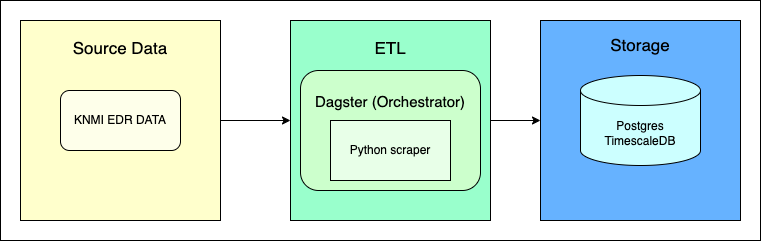

# README
Hi and welcome to my case for vdb. First, I will provide the instructions on how to run this on you system. Then I will provide some reasoning for the choices made
and the next steps needed for this to run in production. 

For this to work, you will need to have docker installed on your laptop.

First, collect your KNMI EDR key and replace the xxx on line 15 in `vandebron/config.py` with your key. (Sorry, due to time constraints I have not been able to properly implement the environment variables)

To set this up, simply run the below command in your terminal in the root of the project.
```shell
make
```

This command will build all the required docker images:
- The scraper
- Images for the databases
- The image for Dagster

(Apologies for the large image (1,2GB) needed for the timescaledb extension of postgres. Please delete this image afterwards: see below.)

Once everything is set up, navigate to http://localhost:3000/locations/vandebron/asset-groups/default. Then, in the upper right corner click 'Materialize'. 
This will run the asset created (the knmi scraper). Then navigate to 'Runs' in the top of the window where you will (hopefully) see a successful run. 

To verify that data has actually been loaded into the database, run the below command. This will fetch 25 rows of data from the database.
```shell
make get-data
```

To view the aggregated data (to 1 hour), call the following command:
```shell
make get-aggregated-data
```

This setup uses the below images. If you like, you can remove these from your system:
- vandebron-vandebron
- timescale/timescaledb-ha (unless you are using this yourself)
- postgres (unless you are using this yourself)
- vandebron-docker_example_webserver
- vandebron-docker_example_daemon

To remove these images, run:
```shell
docker image rm vandebron-vandebron
```


## Set up

#### Scraper
I have created a fairly simple scraper that (for now) collects the 10-minute data for the 17th of February. 
I have added some validation, namely (1) to validate if we receive the same amount of values for all parameters as we have timestamps
and (2) to validate if the parameter values we receive are correct (float) values. The `validate_float` function I have used is now a bit redundant. 
I am not storing all the parameters in this demo. I have thought about the use case for the weather data and from the job description and the previous interview, my guess was that this weather data will be used 
to create a forcast of the energy production by the wind turbines. Google told me that wind speed, air pressure and temperature influence the energy production, thus I have only stored parameters related to those three. 
I have created a model for the data and used the built-in Pydantic functionality to also validate the data. However, the `validate_float` can be extended to add additional validation 
(although Ideally it will be moved to the class itself).
We then store the data in a Postgres database. 

#### Postgres
I have used Postgres with the timescaledb extension as the database. I believe this extension adds value as the data is a timeseries. Likely, this knmi timeseries data will be combined with other timeseries data (e.g. wind turbine data or meter readings).
The timescale extension allows for faster lookup of timeseries data. It also allows for materialized views with defined time buckets. In my setup, I have demonstrated this by creating an hourly reading table which contains the averages of all parameter values of that hour. 
I have also created a separate locations table, with a location_id being used in the `knmi_edr_ten_minutes` table. This is to reduce the noise in the 10-minutes data table and allows for additional metadata to be stored in the locations.
When new locations are configured in this scraper job, the python script automatically stores new locations and used them when storing the data.

#### Transformations
A transformation I suggest is what I described in the above paragraph. If I recall correctly, the electricity market works with hourly data. Therefore, I can image we want all data to be on hourly level. 
Thus, I have created a materialized view that displays the data on an hourly level. I have chosen for an average of each hour, but we can discuss with Data Science if this makes sense. Other aggregations are possible on request ofcourse! :)

#### Dagster
A pipeline needs a scheduler ofcourse. We want new data coming in every day, without us having to manually run the script. 
I have had a go at using Dagster as the scheduler in this setup. I have not used this before, but I heard that you guys are using it, so I wanted to try and use it. 
I was able to deploy the required images, and we are able to run this pipeline using Dagster. 
There are still some limitations to the current setup, but we will discuss them in the next section. 


## Improvements:
Even though there are still a lot of thing to be improved, there is a basis. We are able to collect data, have a basic validation, store the data in a proper format, and we have deployed a scheduler. 
Some next steps will be:
- Actually schedule the job. For instance: run at 01:00 every day to collect the data for that day. Or run every (few) hour(s) if we need the most up-to-date data. It will likely depend on when we need the data and when the data will become available.
- Improve the use of secrets and environment variables. They are now basically all defined within the script. I am sure Dagster has a nice way for this, I have not had the time to dive into this.
- Add more validation on the data coming in, therefore making it more robust than it is at the moment.  